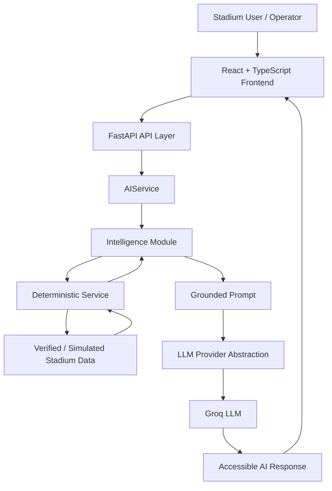

# 🏟️ Avona StadiumAI

### AI-Powered Smart Stadium Operations & Inclusive Fan Assistance Platform


> **Smarter stadium operations. Safer crowd decisions. Inclusive fan experiences. Powered by grounded Generative AI.**

---

## 🔗 Project Links

- **🌐 Live Demo:** [Try Avona StadiumAI](https://avona-stadium-ai.vercel.app/)
- **💻 GitHub Repository:** [View Source Code](https://github.com/jayeshpatil2122/avona-stadium-ai/avona-stadium-ai)
- **📚 API Documentation:** Run the backend locally and visit `http://127.0.0.1:8000/docs` 
## 📖 Overview

**Avona StadiumAI** is an AI-powered smart stadium operations and fan-assistance platform designed to demonstrate how Generative AI can improve experiences inside large sporting venues and international tournaments.

Large stadiums are complex environments. Thousands of visitors may simultaneously need:

- Directions to gates and facilities
- Crowd and congestion information
- Accessibility assistance
- Multilingual communication
- Operational support during incidents
- Clear and understandable guidance

Avona StadiumAI brings these capabilities together inside one unified **AI Stadium Command Center**.

The platform combines:

**Deterministic Stadium Intelligence**

with

**Generative AI**

to provide contextual, grounded, role-aware, multilingual, and accessible assistance.

Instead of allowing a Large Language Model to independently invent operational facts, Avona StadiumAI first retrieves or calculates relevant stadium context and then provides that information to the AI for explanation, translation, or decision-support recommendations.

```text
Verified / Simulated Stadium Context
                ↓
     Deterministic Intelligence
                ↓
       Structured Grounding
                ↓
          Generative AI
                ↓
 Contextual & Accessible Guidance
```

This hybrid architecture helps reduce hallucination risk while preserving the flexibility and natural communication capabilities of Generative AI.

---

# 🎯 The Problem

Modern stadiums and major international sporting events face multiple operational and visitor-experience challenges.

### 🧭 Complex Navigation

Large venues contain gates, concourses, checkpoints, medical facilities, accessible facilities, and seating zones that can be difficult for visitors to navigate.

### 👥 Crowd Pressure

High occupancy in concourses and entry areas can create congestion that requires quick operational awareness and appropriate crowd-flow recommendations.

### ♿ Accessibility Barriers

Visitors with mobility, visual, hearing, or other accessibility needs may require more contextual assistance than traditional static signs or maps provide.

### 🌍 Language Barriers

International sporting events bring together visitors speaking many different languages.

### 🚨 Operational Decision Support

Venue staff and operations teams may need rapid, contextual guidance when dealing with crowd pressure, medical situations, accessibility issues, facility problems, or routine operational conditions.

Traditional stadium websites usually provide static information.

Generic AI chatbots can provide natural-language answers but may lack verified stadium context.

**Avona StadiumAI combines both approaches.**

---

# 💡 The Solution

Avona StadiumAI provides a modular AI intelligence platform with five specialized stadium modules:

1. 🧭 **Navigation Intelligence**
2. 👥 **Crowd Intelligence**
3. ♿ **Accessibility Intelligence**
4. 🌍 **Multilingual Intelligence**
5. 🚨 **Operations Intelligence**

Each module solves a specific stadium challenge while sharing a common AI architecture.

The platform is designed for multiple stakeholders, including:

- Fans
- International visitors
- Visitors with accessibility needs
- Volunteers
- Venue staff
- Operations teams

The architecture can also support future workflows for security, medical, transportation, and sustainability teams as the platform evolves.

---

# 🧠 Why Generative AI?

Avona StadiumAI does not use Generative AI simply as a chatbot.

Instead, AI is used specifically where natural-language intelligence provides meaningful value.

### Deterministic systems handle:

- Stadium route calculation
- Facility lookups
- Crowd occupancy metrics
- Crowd-risk classification
- Accessibility facility data
- Operational scenario retrieval
- Incident severity context

### Generative AI handles:

- Natural-language explanations
- Role-aware instructions
- Contextual recommendations
- Multilingual communication
- Inclusive accessibility guidance
- Operational decision-support explanations

The architecture follows the principle:

> **Deterministic systems provide the facts. Generative AI communicates and contextualizes those facts.**

This makes the platform more predictable, testable, and responsible than relying entirely on an unrestricted LLM.

---

# 🆚 What Makes Avona StadiumAI Different?

## Compared with a Traditional Stadium Website

Traditional stadium websites primarily provide static pages, maps, FAQs, and contact information.

Avona StadiumAI can generate contextual assistance based on:

- User role
- Current stadium location
- Destination
- Accessibility requirement
- Crowd conditions
- Incident type
- Preferred language

---

## Compared with a Generic AI Chatbot

A generic chatbot may generate plausible but incorrect stadium information.

Avona StadiumAI uses deterministic stadium services and structured demo datasets to ground AI prompts before responses are generated.

For example:

```text
User asks for directions
        ↓
Route is calculated using stadium graph
        ↓
Verified route becomes AI context
        ↓
AI explains the calculated route
```

The AI does not independently decide which stadium route exists.

This pattern is also applied to Crowd, Accessibility, and Operations Intelligence.

---

# ✨ The Five Intelligence Modules

| Module | Stadium Problem | Deterministic Intelligence | Generative AI Contribution | Primary Users |
|---|---|---|---|---|
| **Navigation** | Visitors struggle with complex stadium layouts | Bidirectional BFS route calculation | Role-aware natural-language directions | Fans, Volunteers |
| **Crowd** | High occupancy can create crowd pressure | Occupancy ratios and rule-based risk levels | Operational crowd-flow recommendations | Venue Staff, Operations |
| **Accessibility** | Visitors need inclusive facility and route guidance | Accessibility facility lookup and verified routing | Contextual inclusive assistance | Fans |
| **Multilingual** | International visitors face communication barriers | Language configuration, locale and RTL rules | Context-aware multilingual communication | International Visitors |
| **Operations** | Staff need contextual incident decision support | Location + incident scenario lookup and severity context | Grounded operational recommendations | Operations, Venue Staff |

---

# 🧭 1. Navigation Intelligence

Navigation Intelligence helps users move through the stadium using deterministic route calculation combined with AI-generated explanations.

### How It Works

```text
Current Location
      +
Destination
      ↓
Stadium Route Graph
      ↓
Bidirectional BFS
      ↓
Verified Route
      ↓
Generative AI
      ↓
Role-Aware Directions
```

The route itself is calculated by deterministic software.

Generative AI then transforms the verified path into clear, natural-language instructions.

### Example

```text
Main Entrance
      ↓
Security Checkpoint
      ↓
Central Plaza
      ↓
North Concourse
      ↓
Gate A
```

This prevents the LLM from independently inventing stadium routes.

---

# 👥 2. Crowd Intelligence

Crowd Intelligence helps venue staff and operations teams understand simulated crowd-pressure conditions.

The system uses deterministic crowd information such as:

- Zone occupancy
- Zone capacity
- Density percentage
- Risk level

Generative AI then receives the calculated crowd context and produces actionable operational recommendations.

### Example Flow

```text
Stadium Zone
     ↓
Occupancy + Capacity
     ↓
Density Calculation
     ↓
Risk Classification
     ↓
Grounded AI Context
     ↓
Operational Recommendation
```

Possible recommendations may include:

- Redirecting incoming visitor flow
- Increasing staff presence
- Monitoring high-density zones
- Temporarily adjusting entry flow
- Directing visitors toward lower-pressure areas

All current crowd information is based on **simulated demo data**, not live sensor feeds.

The module demonstrates how the same architecture could integrate verified occupancy or sensor feeds in a future production deployment.

---

# ♿ 3. Accessibility Intelligence

Accessibility Intelligence is designed to provide more inclusive stadium assistance.

Supported assistance categories include:

- Wheelchair Access
- Accessible Toilet
- Accessible Seating
- Medical Assistance
- Visual Assistance
- Hearing Assistance
- Reduced Mobility

The system combines:

```text
Current Location
       +
Accessibility Need
       ↓
Accessibility Facility Data
       ↓
Verified Route Context
       ↓
Generative AI
       ↓
Inclusive Guidance
```

The goal is to provide useful assistance while preserving the visitor's dignity, independence, and safety.

The module supports multiple stadium starting locations rather than relying on a single entry point.

---

# 🌍 4. Multilingual Intelligence

International tournaments bring together visitors from many countries and language backgrounds.

Avona StadiumAI provides AI-powered contextual multilingual assistance for **15 target languages**:

- English
- Spanish
- French
- German
- Portuguese
- Arabic
- Hindi
- Mandarin Chinese
- Japanese
- Korean
- Italian
- Dutch
- Turkish
- Indonesian
- Bengali

The multilingual system includes:

- AI-powered translation
- Stadium-aware message context
- Centralized language configuration
- Locale mapping
- Arabic RTL support
- Language-aware Text-to-Speech where supported by the browser
- System voice fallback behavior

The system does not claim guaranteed native-level translation accuracy.

---

# 🚨 5. Operations Intelligence

Operations Intelligence provides contextual decision support for venue staff and operations teams.

The current prototype supports simulated operational scenarios across multiple stadium locations and incident categories.

### Supported Incident Categories

- Crowd
- Medical
- Accessibility
- Facility
- Normal Operations

### Supported Demo Locations

- Main Entrance
- Security Checkpoint
- Central Plaza
- North Concourse
- East Concourse
- Gate A
- Gate B
- Medical Center

The deterministic demo dataset provides coverage for:

```text
8 Locations × 5 Incident Types = 40 Supported Scenarios
```

The Operations Intelligence workflow follows:

```text
Location
   +
Incident Type
   ↓
Verified Simulated Scenario
   ↓
Severity / Operational Context
   ↓
Grounded AI Prompt
   ↓
Operational Decision-Support Recommendation
```

This prevents unsupported location/incident combinations from becoming ungrounded AI requests.

The module is an **operational assistance prototype** and does not dispatch personnel, contact emergency services, or replace official venue procedures.

---

# 👥 Multi-Stakeholder Intelligence

Avona StadiumAI adapts AI guidance according to the selected user role.

## 👤 Fan

Typical needs:

- Finding gates
- Finding facilities
- Accessibility assistance
- Multilingual support

The AI prioritizes clear and easy-to-follow guidance.

---

## 🙋 Volunteer

Typical needs:

- Helping visitors navigate
- Supporting international fans
- Providing visitor-friendly assistance

AI responses can emphasize helpful, guest-oriented instructions.

---

## 🏟️ Venue Staff

Typical needs:

- Local crowd awareness
- Facility issues
- Operational assistance

AI guidance focuses more on practical venue actions.

---

## 🎛️ Operations

Typical needs:

- Crowd pressure
- Incident prioritization
- Operational decision support

Responses prioritize concise operational context and actionable recommendations.

---

# ♿ Accessibility & Inclusive Design

Accessibility is not limited to a single Accessibility module.

Avona StadiumAI includes accessibility-focused capabilities throughout the platform.

### 🔊 Read Aloud

AI responses can be spoken using the browser's native `SpeechSynthesis` API.

This can help:

- Users with visual impairments
- Users with reading difficulties
- Visitors who prefer audio guidance
- Users navigating while moving

---

### ⏹️ Stop Speaking

Users can immediately stop active speech playback.

Speech is also designed to clean up appropriately when navigation changes.

---

### 🔤 Easy Read

The **Aa Larger** control increases response text size and spacing to improve readability.

---

### 📋 Copy Response

AI-generated guidance can be copied directly from the shared response panel.

---

### 🌍 Language-Aware Speech

The system attempts to select a voice matching the target language locale.

Actual voice availability and pronunciation quality depend on the user's browser and operating system.

---

### ↔️ RTL Support

Arabic responses support right-to-left presentation.

---

### ⌨️ Keyboard-Friendly Interaction

Interactive controls use semantic elements and visible focus behavior to improve keyboard navigation.

---

# 💬 Quick Assistance Prompts

The multilingual experience includes quick assistance prompts that help visitors communicate common stadium needs without typing complex messages.

Examples include assistance related to:

- Directions
- Medical help
- Accessibility
- Stadium facilities
- Visitor assistance

These provide faster access to commonly needed stadium communication scenarios.

---

# 🛡️ Grounded AI Transparency

AI-generated response panels can display grounding indicators such as:

> **Grounded in Verified Demo Data**

These indicators help users and evaluators understand that the response was generated using structured application context rather than an unrestricted generic AI conversation.

The grounding source differs by module.

Examples include:

```text
Navigation
→ Verified route graph

Crowd
→ Simulated occupancy and risk data

Accessibility
→ Accessibility facility and route data

Operations
→ Simulated operational scenario data
```

This transparency is an important part of Avona StadiumAI's Responsible AI design.

---

# 🧠 Hybrid Intelligence Architecture

Avona StadiumAI follows a modular architecture that separates deterministic domain logic from Generative AI communication.



---

# 🏗️ Backend Architecture

The backend follows a layered design:

```text
API Route
   ↓
AIService
   ↓
Intelligence Agent
   ↓
Deterministic Domain Service
   ↓
Stadium Data
   ↓
Grounded Prompt
   ↓
LLM Provider Abstraction
   ↓
Groq Provider
```

Key architectural principles include:

- Separation of API and business logic
- Modular intelligence agents
- Provider-independent LLM abstraction
- Deterministic domain services
- Centralized configuration
- Typed Pydantic request validation
- Controlled error handling
- Async AI request flow
- Reusable provider/service instances
- Output token controls
- Safe provider-failure responses

---

# ⚡ Performance & Efficiency

The project includes several optimizations introduced during development.

### Backend

- Async LLM request flow
- Reusable AI service/provider architecture
- Controlled AI output tokens
- Provider timeout handling
- Deterministic processing before AI generation
- No unnecessary AI calls for route or risk calculations

### Frontend

- React lazy-loaded intelligence pages
- Request cancellation using `AbortController`
- Shared AI request hook
- Shared reusable response component
- Web-optimized logo asset
- Lightweight browser-native SpeechSynthesis
- No heavy text-to-speech dependency
- Production Vite build optimization

The project intentionally avoids unnecessary infrastructure such as Redis, message queues, or large state-management frameworks for the current prototype.

---

# 🧩 Shared Frontend Architecture

The frontend uses reusable components and hooks to reduce duplication.

Important shared capabilities include:

```text
useAIRequest
→ Unified API request handling
→ Loading state
→ Error handling
→ Request cancellation

ResponsePanel
→ AI response display
→ Error states
→ Copy
→ Read Aloud
→ Stop Speaking
→ Easy Read
→ Grounding indicator
```

This allows accessibility and response features to work consistently across intelligence modules.

---

# 🛡️ Responsible AI

Avona StadiumAI is designed as an AI-assisted prototype rather than an autonomous stadium control system.

### Important Limitations

- The current stadium datasets are simulated demo data.
- The application does not currently connect to live stadium sensors.
- The application does not dispatch emergency services.
- The application does not replace authorized venue staff.
- Medical-related outputs do not provide medical diagnosis.
- Operational recommendations are decision-support guidance.
- Safety-critical decisions should follow official venue procedures.
- Text-to-Speech quality depends on browser and operating-system voice availability.
- Generative AI availability depends on the configured external LLM provider.

### Hallucination Risk Reduction

Where deterministic data exists, the application supplies structured context to the LLM.

This architecture is designed to **reduce hallucination risk**, not claim that hallucinations are impossible.

---

# 🧪 Simulated Demo Data

The competition prototype uses deterministic simulated stadium datasets.

This allows the project to demonstrate:

- Route calculation
- Crowd-risk analysis
- Accessibility assistance
- Operational incident intelligence

without requiring access to real stadium infrastructure.

### Current Prototype

```text
Simulated Demo Data
        ↓
Deterministic Processing
        ↓
Grounded AI
```

### Potential Production Architecture

```text
Official Venue Systems
+
Live Occupancy Feeds
+
Verified Facility Database
+
Approved Operational Systems
        ↓
Deterministic Intelligence Layer
        ↓
Grounded Generative AI
```

Live integration is considered future work and is not claimed as part of the current prototype.

---

# 🌟 Real-World User Journeys

## Journey 1 — Fan Navigation

```text
Fan enters stadium
↓
Selects current location
↓
Selects destination
↓
Deterministic route is calculated
↓
AI explains the route clearly
↓
User can read or hear guidance
```

---

## Journey 2 — International Visitor

```text
International visitor needs assistance
↓
Selects preferred language
↓
Submits stadium-related message
↓
AI provides multilingual assistance
↓
User can copy or hear response
```

---

## Journey 3 — Accessibility Assistance

```text
Visitor selects accessibility need
↓
System checks accessibility demo data
↓
Relevant facility / route is identified
↓
AI provides inclusive contextual guidance
↓
User can enable Easy Read or Read Aloud
```

---

## Journey 4 — Crowd Management

```text
Operations user selects stadium zone
↓
Occupancy and capacity are analyzed
↓
Risk level is determined
↓
AI receives grounded crowd context
↓
Operational recommendation is generated
```

---

## Journey 5 — Operational Incident

```text
Operations user selects location
↓
Selects incident category
↓
Deterministic scenario is retrieved
↓
Severity and recommended context are provided
↓
AI generates grounded decision-support guidance
```

---

# ⏱️ 3-Minute Evaluator Demo

A quick evaluation path for the strongest features:

### 0–30 seconds — Welcome & Roles

- Launch Avona StadiumAI
- Enter through the Welcome screen
- Select a role
- View the Command Center

### 30–60 seconds — Navigation

- Open Navigation Intelligence
- Select `Main Entrance`
- Select `Gate A`
- Generate the route
- Observe deterministic routing + AI explanation

### 60–90 seconds — Multilingual

- Open Multilingual Intelligence
- Select Spanish, Japanese, or Arabic
- Submit a stadium assistance message
- Test **Speak**
- Test **Copy**
- For Arabic, observe RTL behavior

### 90–120 seconds — Accessibility

- Open Accessibility Intelligence
- Select an accessibility need
- Generate guidance
- Test **Aa Larger**
- Test **Read Aloud**

### 120–150 seconds — Crowd

- Open Crowd Intelligence
- Select a high-density demo zone
- Review deterministic risk information
- Review AI operational recommendation

### 150–180 seconds — Operations

- Switch to Operations role
- Open Operations Intelligence
- Select a location and incident
- Review grounded decision support
- Observe the grounding indicator

---

# 🎯 Challenge Alignment

Avona StadiumAI addresses several important Smart Stadium and Tournament Operations areas.

| Challenge Area | Avona StadiumAI Capability |
|---|---|
| Stadium Navigation | Deterministic route calculation + AI directions |
| Crowd Management | Occupancy analysis + AI operational recommendations |
| Accessibility | Facility and route intelligence + inclusive AI guidance |
| Multilingual Assistance | 15-language contextual communication |
| Operational Intelligence | 40 simulated location/incident scenarios |
| Decision Support | Grounded role-aware AI recommendations |
| International Fan Experience | Multilingual + RTL + Text-to-Speech |
| Inclusive Experience | Accessibility guidance + Easy Read + speech |
| Responsible AI | Deterministic grounding + demo-data transparency |

---

# 🧰 Technology Stack

## Frontend

- React
- TypeScript
- Vite
- CSS
- Browser SpeechSynthesis API

## Backend

- Python 3.11+
- FastAPI
- Pydantic
- Groq Python SDK
- Pytest

## AI

- Provider abstraction layer
- Groq LLM provider
- Grounded prompt architecture
- Role-aware prompting

## DevOps

- Git
- GitHub
- GitHub Actions
- Vercel-ready frontend
- Railway-ready backend

---

# 📁 Project Structure

```text
avona-stadium-ai/
│
├── backend/
│   ├── app/
│   │   ├── agents/
│   │   │   ├── navigation.py
│   │   │   ├── multilingual.py
│   │   │   ├── crowd.py
│   │   │   ├── accessibility.py
│   │   │   └── operations.py
│   │   │
│   │   ├── api/
│   │   │   └── routes/
│   │   │
│   │   ├── core/
│   │   ├── data/
│   │   ├── prompts/
│   │   ├── schemas/
│   │   ├── services/
│   │   │   └── llm/
│   │   └── main.py
│   │
│   ├── tests/
│   ├── .env.example
│   └── requirements.txt
│
├── frontend/
│   ├── public/
│   └── src/
│       ├── api/
│       ├── components/
│       ├── constants/
│       ├── context/
│       ├── hooks/
│       ├── pages/
│       ├── services/
│       ├── styles/
│       └── types/
│
├── .github/
│   └── workflows/
│
├── .gitignore
└── README.md
```

---

# 🔌 API Overview

The main AI endpoint is:

```text
POST /api/ai/generate
```

Example request:

```json
{
  "module": "navigation",
  "user_role": "fan",
  "language": "English",
  "stadium": "Demo World Cup Stadium",
  "location": "Main Entrance",
  "destination": "Gate A",
  "prompt": "Guide me to Gate A."
}
```

Example response structure:

```json
{
  "module": "navigation",
  "response": "AI-generated grounded guidance"
}
```

Module-specific requests may include optional fields such as:

```text
assistance_type
incident_type
```

Interactive FastAPI documentation is available locally at:

```text
http://127.0.0.1:8000/docs
```

---

# 🛠️ Local Setup

## Prerequisites

- Python 3.11+
- Node.js 18+
- npm
- Git
- Groq API key

---

## 1. Clone Repository

```bash
git clone https://github.com/jayeshpatil2122/avona-stadium-ai
cd avona-stadium-ai
```

---

## 2. Backend Setup

```bash
cd backend
python -m venv venv
```

### Windows PowerShell

```powershell
.\venv\Scripts\Activate.ps1
```

### macOS / Linux

```bash
source venv/bin/activate
```

Install dependencies:

```bash
pip install -r requirements.txt
```

Create:

```text
backend/.env
```

Example:

```env
APP_NAME=Avona StadiumAI
APP_VERSION=1.0.0
LLM_PROVIDER=groq
GROQ_API_KEY=your_groq_api_key_here
```

Run backend:

```bash
uvicorn app.main:app --reload
```

Backend:

```text
http://127.0.0.1:8000
```

Swagger:

```text
http://127.0.0.1:8000/docs
```

---

## 3. Frontend Setup

Open another terminal:

```bash
cd frontend
npm install
```

Optional local API configuration:

```env
VITE_API_URL=http://127.0.0.1:8000
```

Start frontend:

```bash
npm run dev
```

---

# 🧪 Testing

The backend currently contains:

> **103 passing automated tests**

The test suite covers areas including:

- API request validation
- Unsupported modules
- Input length validation
- Provider failure handling
- Provider abstraction
- Configuration
- Navigation route lookup
- Navigation service behavior
- Navigation agent grounding
- Crowd data retrieval
- Crowd intelligence grounding
- Accessibility facility lookup
- Accessibility route coverage
- Operations scenario coverage
- Complete Operations location/incident matrix
- Multilingual intelligence behavior

Tests use fake/mock AI providers and do not intentionally consume real Groq API credits.

Run tests:

```bash
cd backend
pytest -v
```

Expected release-candidate result:

```text
103 passed
```

---

# 🔄 Continuous Integration

GitHub Actions is configured to validate the project automatically.

The workflow verifies the configured release checks, including backend test execution and project validation steps defined in the repository workflow.

This helps detect regressions before submission or deployment.

---

# 📦 Repository Efficiency

The release-candidate audit reported approximately:

```text
Tracked Files: 102
Tracked Repository Size: ~0.41 MB
```

The repository intentionally excludes unnecessary generated files such as:

- Virtual environments
- `node_modules`
- Build output
- Python cache files
- Pytest cache
- Local environment secrets

The project also uses a WebP logo asset to reduce repository and frontend asset size.

---

# 🔐 Security & Configuration

Secrets are stored using environment variables.

The Groq API key is used only by the backend.

The repository should never commit:

```text
.env
GROQ_API_KEY values
API secrets
```

The included `.env.example` should contain placeholders only.

Frontend code does not require access to the private Groq API key.

---

# 🚀 Deployment

The architecture supports separate frontend and backend deployment.

### Frontend

Designed for deployment on platforms such as Vercel.

### Backend

Designed for deployment on platforms capable of running FastAPI applications, such as Railway.

Production deployments must configure environment variables securely.

No private API key should be embedded in frontend source code.

---

# 🔮 Future Scope

Avona StadiumAI is currently a competition prototype using deterministic simulated stadium data.

Potential future integrations include:

### 📡 Live Stadium Intelligence

- IoT occupancy sensors
- Live crowd-density feeds
- Official stadium operational systems

### 🗺️ Advanced Navigation

- Official digital stadium maps
- Indoor positioning
- Dynamic route changes
- Temporary closure awareness

### 🚆 Transportation Intelligence

- Public transport information
- Parking intelligence
- Entry/exit traffic recommendations

### 🌱 Sustainability Intelligence

- Energy monitoring
- Waste management insights
- Water consumption intelligence

### 🚨 Official Operational Integrations

- Authorized venue alert systems
- Staff communication platforms
- Verified emergency workflows

### 🔐 Production Security

- Authentication
- Role-based access control
- Audit logs
- Production monitoring

These capabilities are **future work** and are not claimed as part of the current prototype.

---

# 🏆 Key Project Strengths

Avona StadiumAI demonstrates:

- Five specialized AI intelligence modules
- Deterministic + Generative AI hybrid architecture
- Grounded AI responses
- Role-aware AI guidance
- Bidirectional BFS stadium routing
- Crowd-risk intelligence
- Accessibility-focused facility guidance
- 15-language multilingual assistance
- Arabic RTL support
- Language-aware Text-to-Speech
- Easy Read accessibility mode
- Universal AI response controls
- 40 Operations Intelligence demo scenarios
- Grounding transparency indicators
- Async AI provider architecture
- Provider abstraction
- Robust error handling
- 103 automated tests
- CI validation
- Lightweight repository architecture

---

# 🌐 Vision

Avona StadiumAI demonstrates a future where stadium intelligence is not limited to static dashboards or generic chatbots.

The platform combines:

```text
Domain Data
+
Deterministic Intelligence
+
Generative AI
+
Accessibility
+
Multilingual Communication
```

to create a more intelligent and inclusive stadium experience.

The long-term vision is a modular AI intelligence layer capable of helping stadiums provide:

> **The right information, to the right person, in the right language, at the right moment.**

---

## ⚠️ Prototype Disclaimer

Avona StadiumAI is a competition and demonstration prototype.

The current implementation uses simulated stadium data and should not be treated as an official venue safety, medical, navigation, or emergency-response system.

For real-world deployments, all safety-critical capabilities should integrate with verified venue systems and operate under authorized stadium procedures.

---

## 👨‍💻 Project

**Avona StadiumAI**

AI-Powered Smart Stadium Operations & Inclusive Fan Assistance Platform

Built to explore how **grounded Generative AI** can make large sporting venues more intelligent, accessible, multilingual, and operationally aware.